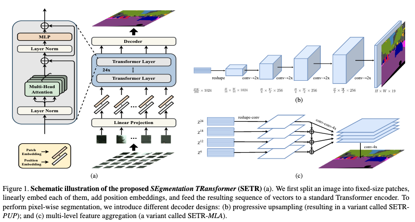

# Segmentation Transformer

Implementation of [Segmentation Transformer](https://arxiv.org/abs/2012.15840) in PyTorch, a new model to achieve SOTA in semantic segmentation while using transformer style encoders.



## Features

- [x] SETR
  - [x] SETR-Naive
  - [x] SETR-PUP
  - [x] SETR-MLA
- [x] SETR-Hybrid

To Do:

- [ ] Training Scripts

## Installation

Create the environment:

```bash
conda env create -f environment.yml
```
